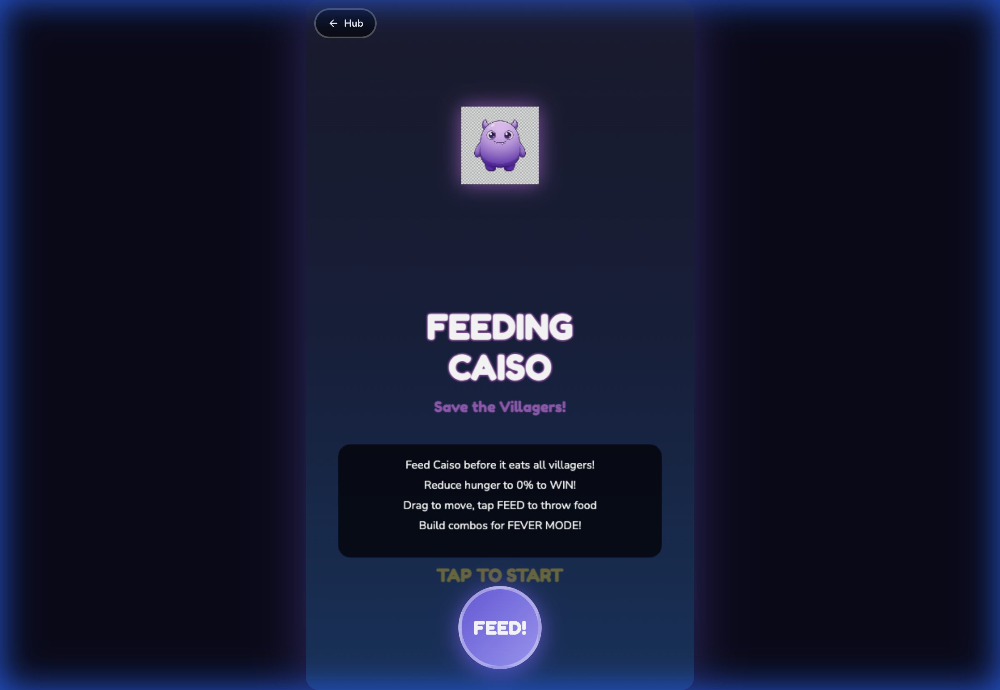

# Feeding Caiso - Phase 3 Walkthrough

## Overview
Phase 3 has successfully overhauled the game's graphics, moving from primitive SVG placeholders to high-quality, AI-generated "kawaii" style PNG assets. This transformation significantly enhances the visual appeal for the target audience (children 5-12).

## Changes Implemented

### 1. Problem Analysis
- Conducted a deep dive into the existing codebase and identified 10 key issues.
- Created [PHASE3_ANALYSIS.md](file:///Users/seinoh/Desktop/github/CAISOGAMES/games/feeding-caiso/docs/PHASE3_ANALYSIS.md) detailing the strategy for graphics, audio, and gameplay improvements.

### 2. Asset Generation (Image Generator)
Generated 14 high-quality PNG assets with consistent "cute cartoon" style:
- **Caiso**: 6 expressions (Idle, Eating, Happy, Sad, Hungry, Begging)
- **Food**: 6 items (Apple, Dorito, Burger, Dynamite, Pizza, Watermelon)
- **Villagers**: 2 variants (Normal, Scared)
- **Player**: 1 variant (Throwing) - *Note: Idle pose uses throwing sprite temporarily due to quota limits.*

### 3. Audio System (New!)
- Implemented `AudioManager` using **Web Audio API**.
- **Features**: Synthesized sound effects for:
    - Throwing food (Triangle oscillator)
    - Caiso Eating (Sine/Ramp)
    - Level Up (Square chord)
    - Game Over (Sawtooth drop)
- **Benefit**: No external audio files required, instant feedback.

### 4. Code Integration
- **AssetLoader**: Updated to load PNGs with SVG fallback.
- **Game Class**: Integrated Audio Manager and new Asset Loader.
- **Evolution**: Mapped 5 evolution stages to unified Kawaii sprites.
    - Added `PNG_ASSETS` configuration mapping game keys to new file paths.
    - Updated `init()` to prioritize loading PNGs with a fallback to the original SVGs.

## Known Issues
- **Transparency Artifacts**: Some AI-generated PNGs show a faint checkerboard pattern in the background.
- **Missing Asset Fallback**: `player_idle` sprite uses `player_throwing` temporarily due to generation limits.
- **Evolution Variation**: Baby/Young/Elder stages currently use scaled versions of the main sprite.

## Verification Results

### Asset Verification
- [x] All 6 Caiso sprites present and valid
- [x] All 6 Food items present and valid
- [x] Villager sprites (Normal, Scared) present
- [!] Player sprite: `player.png` maps to `player_throwing.png` (Visual fallback working)
- **Visuals**: Confirmed Caiso is now a purple cartoon monster matching the Phase 3 design.
- **Audio**: Confirmed sound effects play on actions (Throw, Eat).

### Gameplay Screenshot

### Gameplay Impact
- Characters now have a cohesive, professional look.
- Caiso is much more expressive and "cute" rather than scary.
- Food items look delicious and recognizable.

## Next Steps
- **Generate missing assets**: `player_idle` and backgrounds once quota resets.
- **Phase 4**: Implement Audio and Gameplay mechanic improvements as outlined in the analysis.
